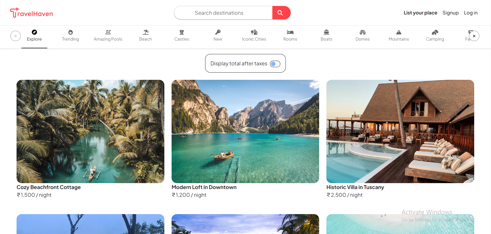
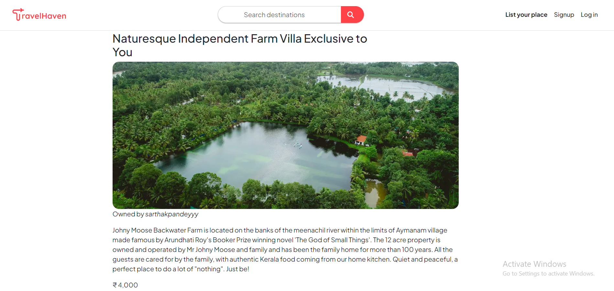
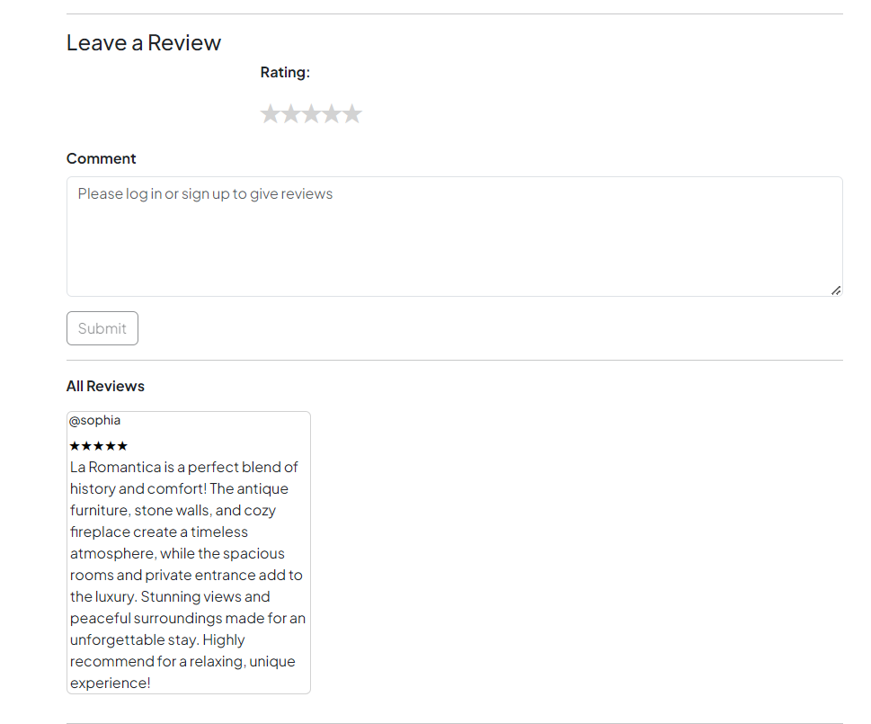
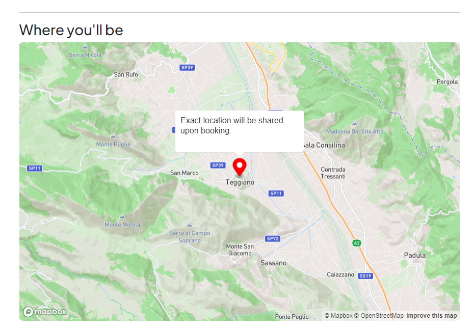

# TravelHaven


TravelHaven is a user-friendly accommodation exploration platform that allows travelers to discover unique places to stay. Built with modern web technologies, TravelHaven showcases a variety of listings and offers a seamless experience for users looking to find their next adventure.

## Key Features

- **Dynamic Listings**: Explore a diverse range of accommodation options, filtered by categories to meet individual preferences.
- **Search Listings**: Easily search listings by title or location to find the perfect accommodation for your needs.
- **User Reviews**: Provide feedback by leaving reviews.
- **Edit Listings**: Manage your own listings by editing the details to keep your information up-to-date.
- **Map View**: View the location of listings on a map to better understand their surroundings and accessibility
- **Responsive Design**: Optimized for both desktop and mobile devices, ensuring a smooth user experience on any screen.
- **User Authentication**: Secure sign-up and login processes, allowing users to manage their profiles with ease.

## Technologies Used

- **Frontend:**
  - HTML5
  - CSS3
  - JavaScript
  - EJS
  - Mapbox (for displaying map locations)

- **Backend:**
  - Node.js
  - Express.js
  
- **Database:**
  - MongoDB (via MongoDB Atlas)

- **Media Managment**
  - Cloudinary (for image storage)

- **Deployment:**
  - Render

## Live Demo

You can check out a live demo of TravelHaven <a href="https://delta-demo-kdz1.onrender.com" target="_blank">here</a>.

## Website Showcase

Below are some images showcasing the features of TravelHaven:

### Homepage


### Sample Listing View


### Reviews and Comments


### Map View


## Getting Started

To run TravelHaven locally, follow these steps:

### Prerequisites

- Node.js
- npm

### Installation

1. Clone the repository:
   ```bash
   https://github.com/SarthakPandey1008/TravelHaven.git

2. Navigate to the project directory:
   ```bash
   cd travelhaven

3. Install dependencies:
   ```bash
   npm install

4. Set up your environment variables:

   To run this project, you need to set up your environment variables by creating a .env file in the root directory of the project
   ```bash
   CLOUD_NAME=your-cloudinary-cloud-name
   CLOUD_API_KEY=your-cloudinary-api-key
   CLOUD_API_SECRET=your-cloudinary-api-secret

   MAP_TOKEN=your-mapbox-access-token

   ATLASDB_URL=your-mongodb-connection-string

   SECRET=your-session-secret


5. Start the application:
   ```bash
   npm start

## Acknowledgments

- Inspired by popular accommodation-sharing platforms.
- Special thanks to the libraries and frameworks that made this project possible.


